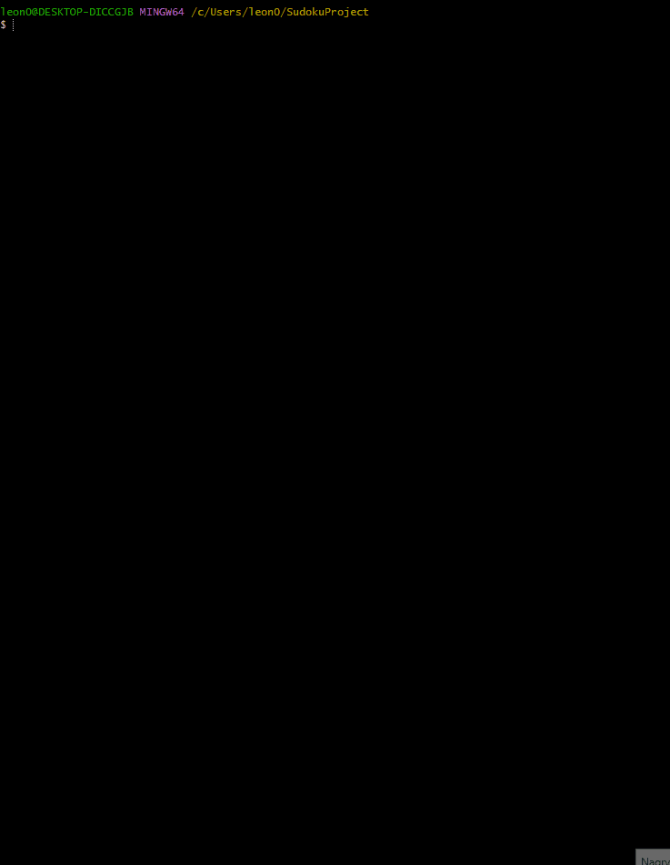

# 🧩 Sudoku

 <!-- ← ścieżka do gifa; jeśli masz inną, podmień -->


* Rozmiary planszy **4 × 4**, **9 × 9** oraz **16 × 16**  
* Generator z back-trackingiem i maskami bitowymi  
* Walidacja ruchu w czasie rzeczywistym  
* Polecenia `save` / `load` zapisują postęp do **save.txt**

---

## ✨ Zrealizowane funkcje

| Kategoria          | ✔ |
|--------------------|--- |
| Rozmiary planszy   | ✅ |
| Generator          | ✅ | 
| Walidacja ruchu    | ✅ | 
| Zapisywanie / load | ✅ | 
| Obsługa ruchu      | ✅ | 

---

## 🛠️ TODO (Mam wyjazd przedwczesny majówkowy, wiem, że miałem na to 3 tygodnie)
## Dużo komplikacji było, nie chcę tego powtarzać, śni mi się po nocach te sudoku.
(Szanowny Panie Łukaszu chciałbym tylko to zaliczyć)

| Plan                             | Status | Uwagi                                               |
|----------------------------------|--------|-----------------------------------------------------|
| Cofanie / czyszczenie ruchu      | ❌     |                                                     |
| Stoper + licznik ruchów          | ❌     |                                                     |
| Gwarancja jednego rozwiązania    | ❌     | Generator sprawdza poprawność, lecz nie unikalność  |

---

## ⏳ Kompilacja i uruchomienie

## Meme of the month

### MinGW / GCC – najszybciej

```bash
gcc *.c -std=c11 -Wall -O2 -o sudoku.exe
./sudoku.exe

